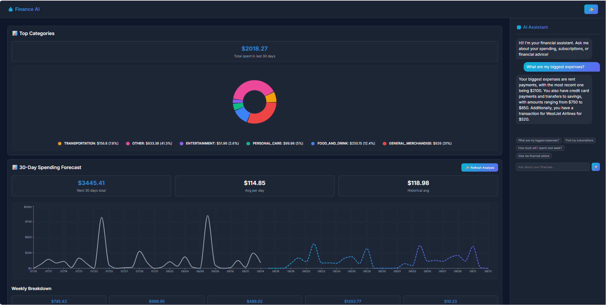
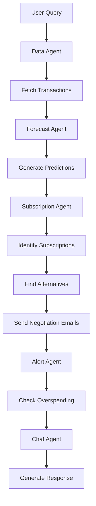

# 🏦 Finance Assistant

An intelligent personal finance management system that combines AI-powered analysis with real-time banking data to provide comprehensive financial insights, forecasting, and automated subscription management.



## 🌟 Features

### 🔗 **Bank Integration**
- **Plaid API Integration**: Securely connect to 11,000+ banks and financial institutions
- **Real-time Transaction Sync**: Automatic transaction categorization and storage
- **Account Management**: Multi-account support with balance tracking

### 🤖 **AI-Powered Analysis**
- **Intelligent Chat Agent**: Natural language financial queries and advice
- **Spending Forecasting**: 2-week spending predictions using Prophet time series analysis
- **Subscription Detection**: AI identifies recurring payments and subscriptions
- **Expense Analysis**: Smart categorization and spending pattern recognition

### 📊 **Advanced Analytics**
- **Interactive Dashboard**: React-based frontend with real-time charts
- **Spending Trends**: Visual analysis of spending patterns by category
- **Budget Alerts**: Automated overspending notifications
- **Financial Forecasting**: Predictive analytics for future expenses

### 💰 **Subscription Management**
- **Auto-Discovery**: AI identifies recurring subscriptions from transaction data
- **Negotiation Automation**: Generates and sends discount request emails
- **Alternative Research**: Finds cheaper alternatives with pricing comparisons
- **Cost Optimization**: Tracks potential savings opportunities

## 🏗️ Architecture

### Backend (Python/FastAPI)
- **FastAPI**: High-performance REST API
- **LangGraph**: Multi-agent orchestration framework
- **Groq LLM**: AI-powered financial analysis
- **Supabase**: PostgreSQL database for transaction storage
- **Prophet**: Time series forecasting

### Frontend (React)
- **React 18**: Modern component-based UI
- **Recharts**: Interactive financial charts
- **Plaid Link**: Secure bank connection interface
- **Axios**: API communication

### AI Agents
- **Data Agent**: Transaction fetching and categorization
- **Forecast Agent**: Spending prediction and trend analysis
- **Subscription Agent**: Recurring payment management
- **Alert Agent**: Overspending notifications
- **Chat Agent**: Natural language financial advisor

## 🚀 Quick Start

### Prerequisites
- Python 3.8+
- Node.js 16+
- Plaid Developer Account
- Supabase Account
- Groq API Key

### 1. Clone Repository
```bash
git clone <repository-url>
cd Finance Assistant
```

### 2. Backend Setup
```bash
# Create virtual environment
python -m venv venv
source venv/bin/activate  # On Windows: venv\Scripts\activate

# Install dependencies
pip install -r requirements.txt
```

### 3. Environment Configuration
Create `.env` file in root directory:
```env
# Plaid Configuration
PLAID_CLIENT_ID=your_plaid_client_id
PLAID_SECRET=your_plaid_secret_key
PLAID_ENV=sandbox  # or development/production

# Supabase Configuration
SUPABASE_URL=your_supabase_url
SUPABASE_KEY=your_supabase_anon_key

# AI Configuration
GROQ_API_KEY=your_groq_api_key

# Email Configuration (for alerts)
SMTP_SERVER=smtp.gmail.com
SMTP_PORT=587
EMAIL_USER=your_email@gmail.com
EMAIL_PASSWORD=your_app_password
```

### 4. Database Setup
Set up Supabase tables:
```sql
-- Accounts table
CREATE TABLE accounts (
    id SERIAL PRIMARY KEY,
    name VARCHAR(255) NOT NULL,
    type VARCHAR(100) NOT NULL,
    balance DECIMAL(10,2) DEFAULT 0,
    created_at TIMESTAMP DEFAULT NOW()
);

-- Transactions table
CREATE TABLE transactions (
    id SERIAL PRIMARY KEY,
    account_id INTEGER REFERENCES accounts(id),
    description TEXT NOT NULL,
    date DATE NOT NULL,
    amount DECIMAL(10,2) NOT NULL,
    category VARCHAR(255),
    plaid_transaction_id VARCHAR(255) UNIQUE,
    created_at TIMESTAMP DEFAULT NOW()
);
```

### 5. Frontend Setup
```bash
cd frontend
npm install
```

### 6. Run Application
```bash
# Start backend (from root directory)
uvicorn main:app --reload --port 8000

# Start frontend (from frontend directory)
cd frontend
npm start
```

Visit `http://localhost:3000` to access the application.

## 📡 API Endpoints

### Authentication & Banking
- `POST /api/create_link_token` - Generate Plaid Link token
- `POST /api/exchange_token` - Exchange public token for access token
- `POST /api/get_transactions` - Fetch and store transactions
- `POST /api/get_recurring_transactions` - Get recurring transactions

### AI Analysis
- `GET /api/forecast_spending` - Generate spending forecast
- `GET /api/identify_subscriptions` - AI subscription analysis
- `POST /api/analyze_finances` - Complete financial analysis
- `POST /api/chat` - Chat with AI financial advisor
- `GET /api/analyze_expenses` - Intelligent expense analysis

## 🧠 AI Agents Workflow



## 🔧 Configuration

### Plaid Environment
- **Sandbox**: Testing with fake data
- **Development**: Real data, limited institutions
- **Production**: Full access, requires approval

### AI Model Configuration
- **Default Model**: `llama-3.3-70b-versatile`
- **Temperature**: 0.1-0.3 for financial accuracy
- **Max Tokens**: Configurable per agent

## 📊 Data Flow

1. **Bank Connection**: User connects bank via Plaid Link
2. **Data Sync**: Transactions automatically fetched and categorized
3. **AI Analysis**: Multiple agents analyze spending patterns
4. **Forecasting**: Prophet generates 2-week spending predictions
5. **Subscription Management**: AI identifies and negotiates subscriptions
6. **Alerts**: Automated notifications for overspending
7. **Chat Interface**: Natural language financial advice

## 🛡️ Security

- **Environment Variables**: Sensitive data stored in `.env`
- **Plaid Security**: Bank-grade encryption for financial data
- **API Authentication**: Supabase Row Level Security
- **CORS Configuration**: Restricted origins in production

## 🧪 Testing

### Backend Testing

# Manual API testing
curl -X POST http://localhost:8000/api/create_link_token
```

### Frontend Testing
```bash
cd frontend
npm test
```

## 📈 Performance

- **Response Time**: < 2s for most API calls
- **Forecast Generation**: ~5-10s for complex predictions
- **Real-time Updates**: WebSocket support for live data
- **Caching**: Redis integration for frequently accessed data

## 🔮 Future Enhancements

- [ ] **Investment Tracking**: Portfolio analysis and recommendations
- [ ] **Bill Prediction**: AI-powered bill forecasting
- [ ] **Credit Score Monitoring**: Integration with credit bureaus
- [ ] **Tax Optimization**: Automated tax-saving suggestions
- [ ] **Mobile App**: React Native mobile application
- [ ] **Voice Interface**: Voice-activated financial queries
- [ ] **Advanced ML**: Custom models for spending prediction

## 🤝 Contributing

1. Fork the repository
2. Create feature branch (`git checkout -b feature/amazing-feature`)
3. Commit changes (`git commit -m 'Add amazing feature'`)
4. Push to branch (`git push origin feature/amazing-feature`)
5. Open Pull Request

## 📄 License

This project is licensed under the MIT License - see the [LICENSE](LICENSE) file for details.

## 🙏 Acknowledgments

- **Plaid**: Secure banking API infrastructure
- **Supabase**: Real-time database and authentication
- **Groq**: High-performance AI inference
- **LangChain**: AI agent orchestration framework
- **Prophet**: Time series forecasting library

---

**Built with ❤️ for better financial management**
